# Networking Homelab

A hands-on networking and systems administration lab built to reinforce my CCNA knowledge and develop practical experience with Cisco switching, VLANs, virtualization, firewalls, Active Directory, DNS, and network troubleshooting.

This project is also the foundation for a larger enterprise-style lab that will eventually model the type of physical and virtual networking found in a plant environment.

## Lab Overview

The lab combines physical Cisco networking equipment with VMware-based virtual infrastructure. The environment currently includes a Cisco Catalyst 2960, Dell OptiPlex 5050, laptop, OPNsense, Windows Server, and Windows 11 client virtual machines.

### Physical Equipment

- Cisco Catalyst 2960 switch
- Dell OptiPlex 5050
- Laptop
- USB-to-RJ45 console cable
- CAT6 solid-copper cabling
- RJ45 crimping tools
- CAT6 keystone jacks
- Patch panel
- Cable tester

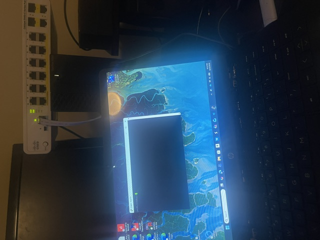

## 1. Cisco Switch Configuration

The lab began with console access to the Cisco Catalyst 2960. I identified the correct COM port in Windows Device Manager, configured PuTTY for serial communication, and accessed the Cisco IOS CLI.

Initial configuration included:

- Setting the switch hostname
- Clearing the previous configuration from the switch
- Creating a management VLAN
- Assigning a management IP address
- Configuring SSH access
- Testing remote management from another lab system

The switch is used primarily as the Layer 2 portion of the physical network while OPNsense provides Layer 3 routing between networks.

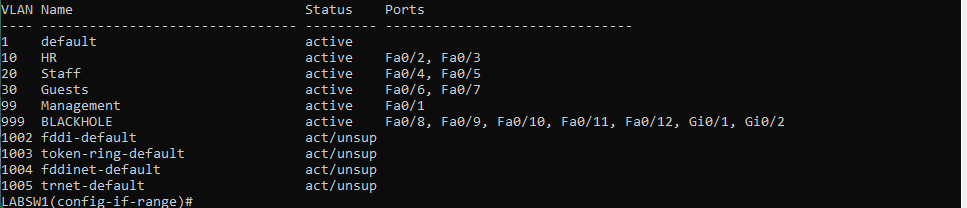

## 2. Physical Cabling

I built and tested CAT6 Ethernet cables using the T568B wiring standard. I also worked with RJ45 connectors, keystone jacks, and a patch panel to make the physical portion of the lab more representative of an enterprise environment.

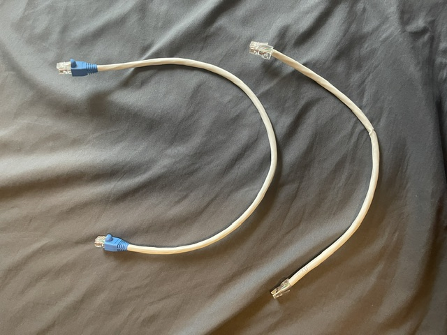

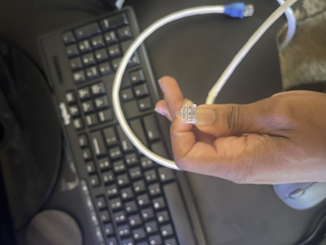

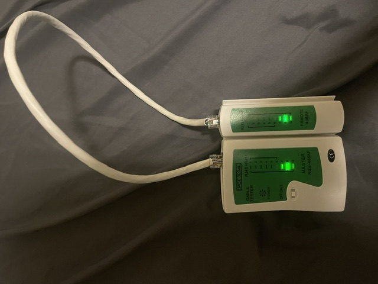

### Cabling Lessons

Building the cables provided hands-on experience with physical-layer troubleshooting. I encountered issues with cable termination, connector compatibility, and pin alignment. Testing each cable before putting it into the network helped isolate physical problems before moving on to Layer 2 and Layer 3 troubleshooting.

## 3. VLANs and Switching

I configured multiple VLANs to separate different types of network traffic, including HR, Staff, and Guest networks. Unused switch interfaces were placed into a separate VLAN and shut down as an additional security measure.

The VLAN work reinforced:

- Access-port configuration
- VLAN assignment
- Management VLANs
- Switch-port security practices
- 802.1Q trunking concepts
- Layer 2 segmentation

## 4. VMware Virtualization and OPNsense

The virtualization portion of the lab introduced OPNsense as a virtual firewall/router. VMware Workstation was used to create isolated virtual networks and connect the virtual environment to the physical network.

### Virtual Environment

| Component | Configuration |
| --- | --- |
| Hypervisor | VMware Workstation |
| Firewall/Router | OPNsense |
| Virtual WAN | Bridged networking |
| Virtual LAN | VMware Host-only networking |
| Management Network | `10.0.0.0/24` |
| OPNsense LAN | `10.0.0.2/24` |

I configured OPNsense interfaces, created VLANs, assigned Layer 3 gateway addresses, and configured DHCP scopes for the lab networks.

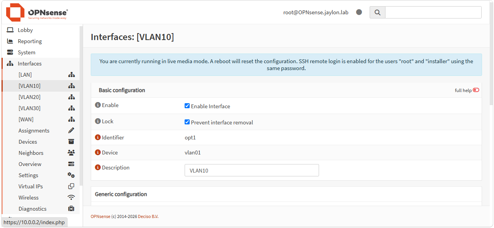

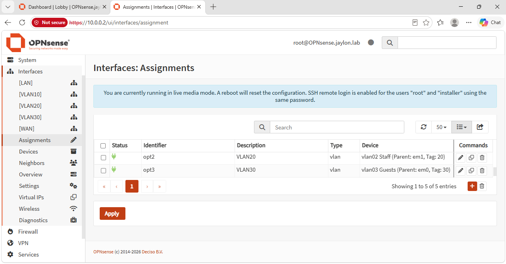

## 5. Windows Server and Active Directory

A Windows Server virtual machine was deployed as the domain controller for the lab. Active Directory Domain Services and DNS were installed to provide centralized identity management, authentication, and name resolution.

### Domain Controller

- Hostname: `LAB-DC01`
- IP Address: `10.0.0.4/24`
- Default Gateway: `10.0.0.2`
- Domain: `jaylon.lab`
- Roles: Active Directory Domain Services and DNS

I created an organizational unit for lab users and created separate administrative and standard user accounts to demonstrate basic privilege separation.

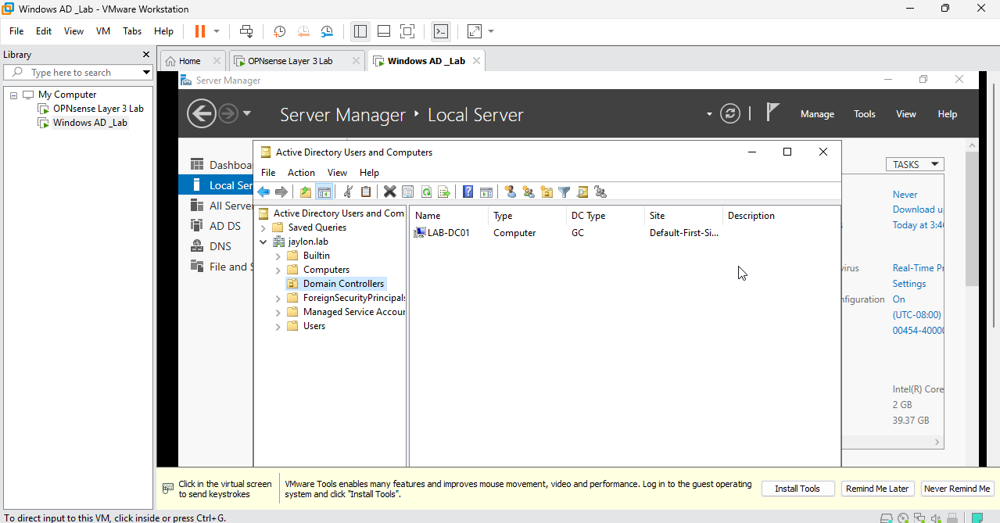

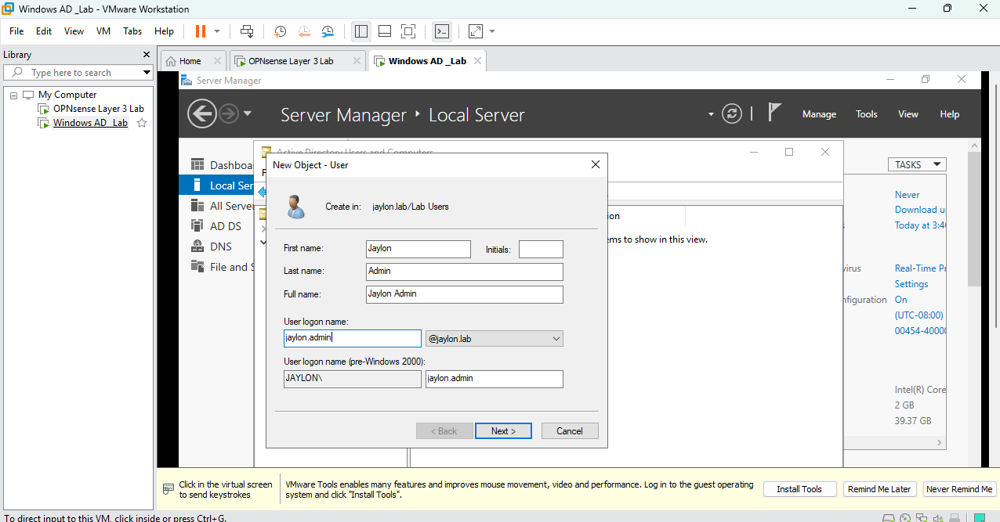

## 6. Windows 11 Domain Client

A Windows 11 virtual machine named `LAB-CLIENT01` was connected to the VMware host-only network and configured to use the domain controller for DNS.

- IP Address: `10.0.0.20`
- Subnet Mask: `255.255.255.0`
- Gateway: `10.0.0.2`
- DNS: `10.0.0.4`
- Domain: `jaylon.lab`

The client successfully joined the domain and authenticated using an Active Directory user account.

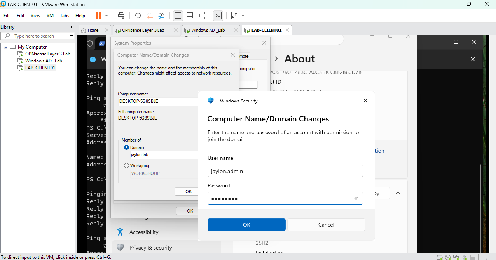

## 7. Hybrid Physical + Virtual Network

The final phase of the lab connects the physical Cisco network to the virtual OPNsense environment.

The physical OptiPlex Ethernet interface connects to the Cisco Catalyst 2960. VMware bridged networking connects a virtual OPNsense interface to that physical adapter, allowing the virtual router to communicate with the physical switch.

The networks were separated to avoid overlapping subnets:

| Network | Address | Purpose |
| --- | --- | --- |
| OPNsense LAN | `10.0.0.0/24` | Virtual lab network |
| Physical management | `10.0.99.0/24` | Cisco management network |
| OPNsense physical-side interface | `10.0.99.254/24` | Route to physical network |
| Cisco management | `10.0.99.1/24` | Switch management |

This separation resolved a routing conflict that occurred when two OPNsense interfaces were initially configured on the same subnet.

### Connectivity Testing

Connectivity was tested from multiple points in the environment using `ping`, `tracert`, `arp`, `ifconfig`, and route-table inspection.

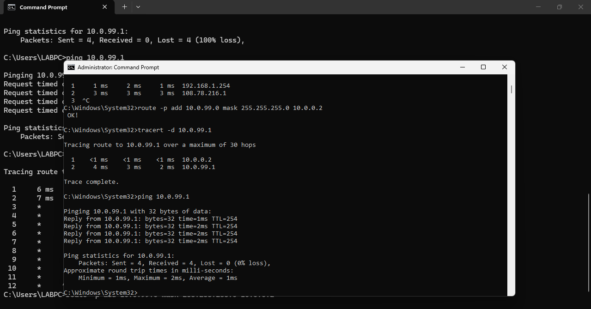

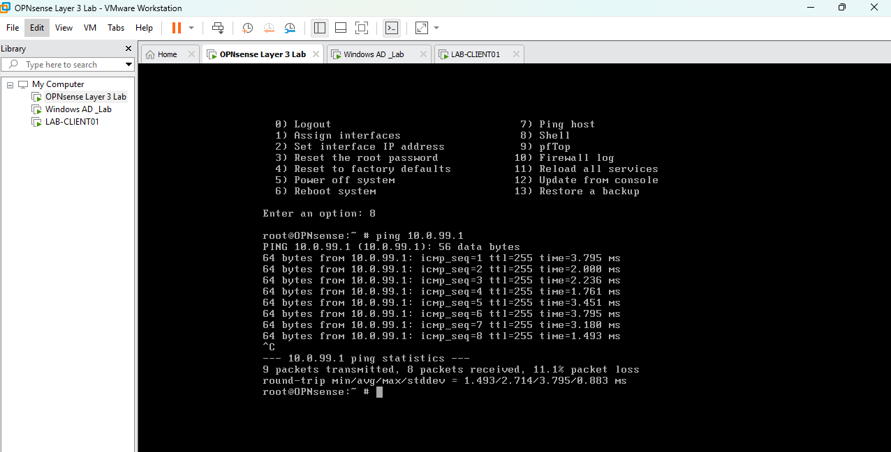

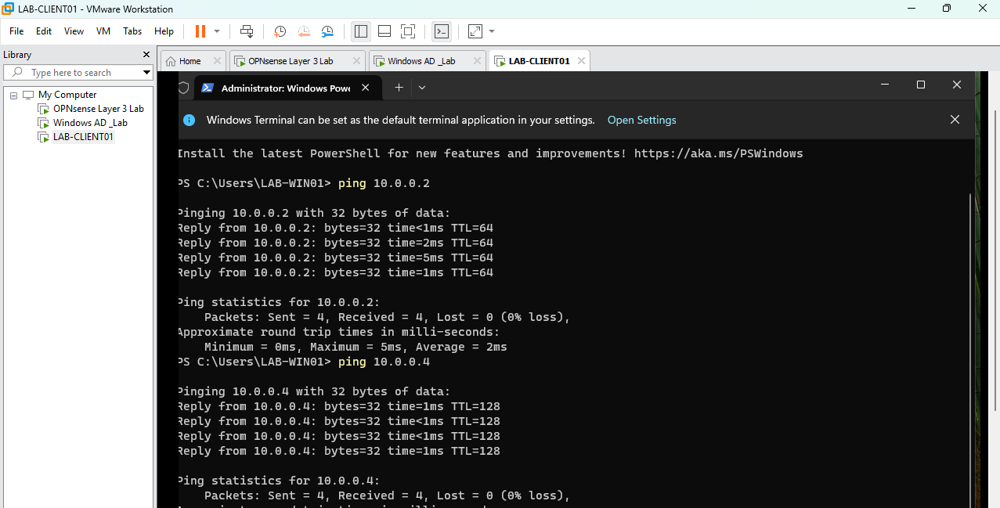

Successful tests confirmed connectivity between the physical switch, OPNsense, the Windows client, and the Active Directory server.

## 8. Troubleshooting

Troubleshooting has been an important part of the lab. Instead of changing multiple configurations at once, I practiced isolating problems by looking at the physical layer, Layer 2, and Layer 3 independently.

One example involved OPNsense initially having two interfaces on the same `10.0.0.0/24` network. A route lookup showed that traffic intended for the physical Cisco network was being sent through the wrong interface. Moving the physical-side network to `10.0.99.0/24` allowed OPNsense to select the correct interface and restored connectivity.

I also encountered an SSH compatibility issue when connecting to the older SSH server on the Cisco switch. Troubleshooting the issue provided practical experience with legacy network equipment and SSH client compatibility.

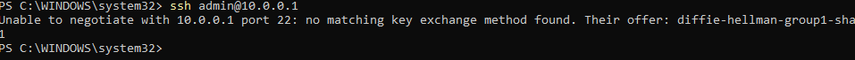

## Skills Practiced

### Networking

- Cisco IOS configuration
- VLAN configuration and segmentation
- Access ports and trunking concepts
- IPv4 addressing and subnetting
- Layer 2 switching
- Layer 3 routing
- Static routes
- Network troubleshooting
- Physical Ethernet cabling
- T568B termination

### Virtualization and Firewalls

- VMware Workstation
- VMware NAT, Bridged, and Host-only networking
- OPNsense installation and configuration
- VLAN interfaces
- DHCP scopes
- Firewall/router concepts
- Virtual-to-physical network connectivity

### Windows Server and Systems Administration

- Windows Server deployment
- Active Directory Domain Services
- Domain controllers
- DNS
- Organizational Units
- User account management
- Administrative vs. standard accounts
- Windows domain joining
- Group Policy fundamentals

## Lessons Learned

This lab reinforced that networking problems are often easier to solve by working through the layers instead of assuming the configuration is the problem. Physical cable testing, switch configuration, IP addressing, routing tables, DNS, and application-level connectivity all need to be considered separately.

The biggest benefit of the project has been taking concepts learned through the CCNA and implementing them on actual hardware and virtual machines. The lab also provided experience troubleshooting situations that are difficult to reproduce in Packet Tracer alone, particularly physical cabling, VMware networking, legacy Cisco equipment, and the interaction between physical and virtual networks.

[Read the full lessons learned here: ](LESSONS-LEARNED)

## Future Plans

- Expand the VLAN architecture
- Build additional Windows Server services
- Add more Windows clients
- Expand Active Directory and Group Policy configuration
- Add additional physical networking equipment
- Implement more advanced routing and firewall rules
- Continue integrating physical and virtual networking
- Begin the larger enterprise-style plant network project
